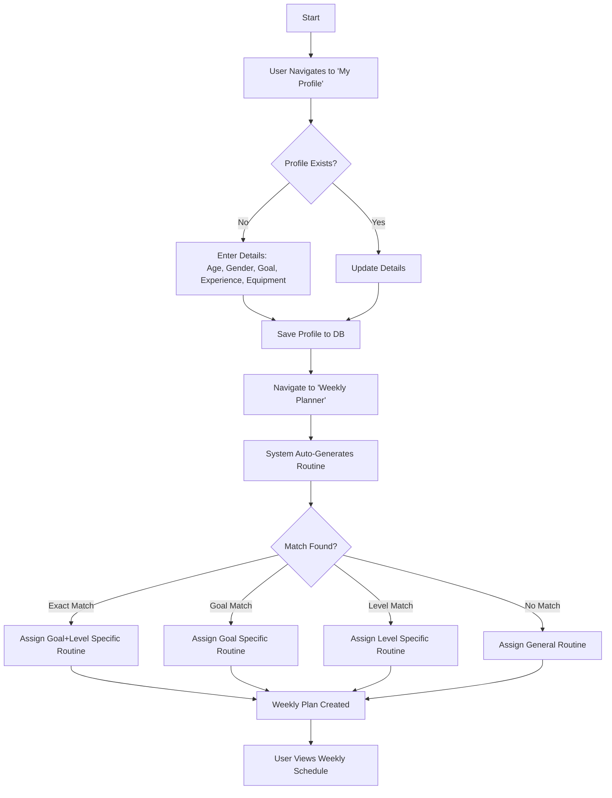
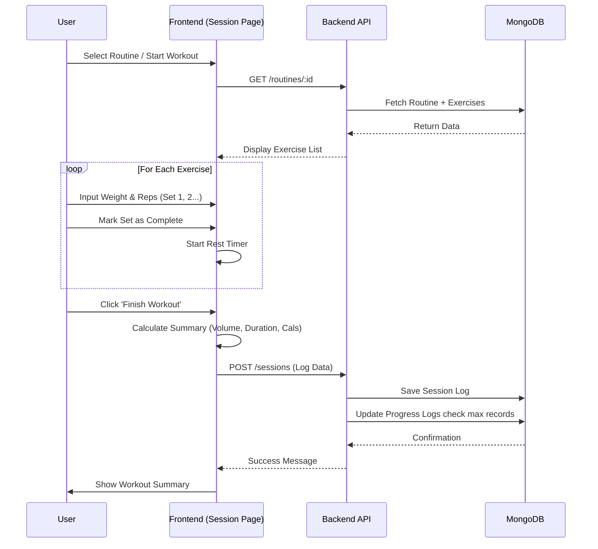

# Module-1: Workout & Exercise Management - Workflow & Documentation

## 1. Overview
Module-1 serves as the core fitness component of PowerHub, allowing users to manage their workout profiles, generate personalized routines, track active sessions, and monitor progress over time. It is designed to be a comprehensive digital personal trainer.

## 2. Tech Stack

### Frontend
- **Framework**: React 18+ (Vite)
- **Styling**: Tailwind CSS (Utility-first styling)
- **State Management**: React Hooks (`useState`, `useEffect`, `useContext`)
- **Routing**: React Router DOM (v6+)
- **HTTP Client**: Axios
- **Data Visualization**: Chart.js / React-Chartjs-2
- **Icons**: Lucide React (or standard SVG icons)

### Backend
- **Runtime**: Node.js
- **Framework**: Express.js
- **Database**: MongoDB Atlas
- **ODM**: Mongoose
- **Authentication**: JWT (JSON Web Token)

## 3. Database Schema (Key Models)
- **UserWorkoutProfile**: Stores physical attributes (age, gender), fitness goals, experience level, and equipment availability.
- **Exercise**: Library of exercises with metadata (targets, equipment, difficulty, video URL).
- **WorkoutRoutine**: Pre-defined or generated routines consisting of multiple exercises.
- **WorkoutSession**: Logs of completed workouts, including duration, calories, and sets/reps.
- **WeeklyPlan**: Schedule of routines assigned to specific days of the week.
- **ProgressLog**: granular history of performance (weight, reps, volume) for specific exercises.

---

## 4. Workflows & Diagrams

### 4.1. User Profile Creation & Routine Generation
The user starts by creating a workout profile. The system then generates a personalized routine based on these inputs.



### 4.2. Active Workout Session
This workflow represents the user performing a workout for the day.



### 4.3. Progress Tracking & Analytics
How the system processes and displays user progress.

```mermaid
flowchart LR
    subgraph Data Collection
    A[Completed Session] -->|Triggers| B[Progress Calculation]
    B --> C[Extract Max Weight per Exercise]
    B --> D[Calculate Total Volume per Exercise]
    end

    subgraph Storage
    C -->|Update| E[(ProgressLog Collection)]
    D -->|Update| E
    end

    subgraph Visualization
    User[User] -->|Views Dashboard| F[Frontend Dashboard]
    F -->|Request| G[GET /progress]
    G -->|Fetch| E
    E -->|Return Data| F
    F -->|Render| H[Line Charts (Volume/Strength Over Time)]
    end
```

## 5. API Endpoints (Module-1)

| Method | Endpoint | Description |
| :--- | :--- | :--- |
| **GET** | `/api/v1/workouts/profile` | Get user profile details |
| **POST** | `/api/v1/workouts/profile` | Create/Update profile |
| **GET** | `/api/v1/workouts/routines` | Get all available routines |
| **GET** | `/api/v1/workouts/routines/generate` | Generate routine based on profile |
| **GET** | `/api/v1/workouts/sessions` | Get history of past sessions |
| **POST** | `/api/v1/workouts/sessions` | Log a completed session |
| **GET** | `/api/v1/workouts/progress` | Get progress data for charts |
| **GET** | `/api/v1/workouts/exercises` | Browse exercise library |
